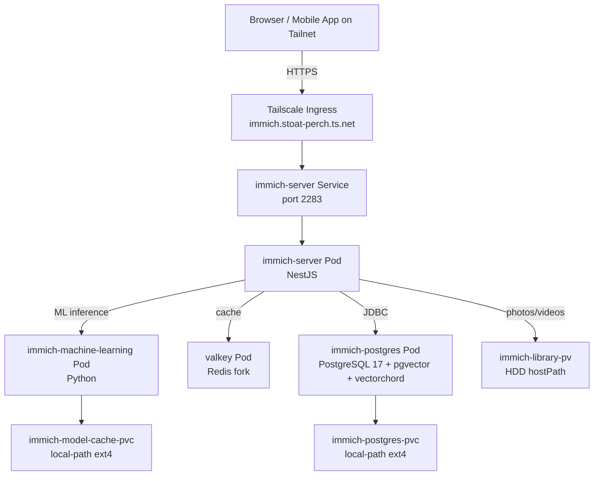

# Immich — Architecture & Tech Stack

**On this page:** [Deployment diagram](#deployment-diagram) · [What is it](#what-is-it) · [Tech stack](#tech-stack) · [Source code](#source-code) · [Config files (this repo)](#config-files-this-repo) · [Storage tier (cluster-setup repo)](#storage-tier-cluster-setup-repo) · [Data layout](#data-layout) · [Why immich-postgres is separate from shared-postgres](#why-immich-postgres-is-separate-from-shared-postgres) · [Design decisions](#design-decisions) · [What you'd change to upgrade Immich major version](#what-youd-change-to-upgrade-immich-major-version) · [Reference](#reference)

## Deployment diagram



## What is it

[Immich](https://immich.app) is a self-hosted Google Photos replacement. AI face recognition, smart search, mobile auto-backup, web/mobile/desktop apps. Open source.

## Tech stack

| Layer | Tech |
|---|---|
| App | Immich (Node.js + NestJS + Python ML) — official Docker images |
| Components | `immich-server`, `immich-machine-learning`, `valkey` (Redis fork), `immich-postgres` (custom) |
| Container | Helm chart `immich/immich 0.11.1` (app v2.7.5 via image tag override) |
| Storage (photos) | hostPath PVC pointing at HDD |
| Storage (DB) | PVC on `local-path` (VM ext4) — Postgres won't run on exFAT |
| Postgres extensions | `pgvector` + `vectorchord` (for AI vector similarity search) |
| Postgres image | `ghcr.io/immich-app/postgres:17-vectorchord0.4.3-pgvector0.8.0` |
| Ingress | Tailscale Ingress (HTTPS) + LAN via launchd port-forward |
| Cluster | k3s in OrbStack |

## Source code

Immich is **off-the-shelf** — no custom code from us. We provide config + storage + Postgres deployment.

| | |
|---|---|
| Upstream code | https://github.com/immich-app/immich |
| Helm chart | https://github.com/immich-app/immich-charts |
| Docker images | https://github.com/orgs/immich-app/packages |

## Config files (this repo)

| File | Purpose |
|---|---|
| `values/immich-values.yaml` | Helm values (DB env, resource limits, probes, ML replicas) |
| `k8s/postgres.yaml` | Postgres StatefulSet + Secret + Service |
| `k8s/photos-readonly-pv.yaml` | Read-only PV for Jellyfin (HDD-backed) |
| `k8s/backup-cronjob.yaml` | Nightly backup CronJob (suspended by default) |
| `deploy.sh` / `undeploy.sh` | Idempotent deploy/teardown scripts |

## Storage tier (cluster-setup repo)

Photos larger than 2 GiB are moved to the external HDD via symlinks by the
**tier-mover-immich** CronJob. This repo is the *consumer* side only — it
mounts `${HOMELAB_TIER_HDD_PATH}/immich-library` as `/data-hdd` inside the
server pod so Immich can follow those symlinks for tiered files.

The tier-mover CronJob, `tier-now.sh` manual trigger, and tiered-storage
documentation live in the cluster-setup repo:
[github.com/seenimurugan/homelab-cluster-setup](https://github.com/seenimurugan/homelab-cluster-setup)

## Data layout

```
${HOMELAB_HDD_PATH}/immich/
└── upload/                ← mounted into pod as /usr/src/app/upload
    ├── library/<user-uuid>/{YYYY}/{YYYY-MM-DD}/<filename>   ← originals (single source of truth)
    ├── upload/            ← in-flight uploads (temp)
    ├── thumbs/            ← auto-regenerable
    ├── encoded-video/     ← auto-regenerable
    └── profile/

${HOMELAB_TIER_HDD_PATH}/immich-library/   ← tiered files (written by tier-mover, mounted as /data-hdd)

local-path PVC (VM ext4)
└── immich-postgres data   ← metadata, albums, face data, smart-search vectors
```

## Why immich-postgres is separate from shared-postgres

Immich requires `pgvector` + `vectorchord` Postgres extensions for AI vector search. The shared Postgres (used by chores, emailmatrix, etc.) is a vanilla Postgres image — no vector extensions. Adding them retroactively would mean stopping shared-postgres, swapping the image, running migrations — risky for the other apps.

Cleaner to leave each Postgres alone:
- `immich-postgres` (specialized, vector-enabled)
- `shared-postgres` (vanilla, for the other apps)

## Design decisions

- **CLI uses cluster DNS not localhost** — kubectl port-forward dies under bulk-upload load. Cluster DNS is direct via OrbStack network bridge — no fragility. See [BULK-UPLOAD.md](BULK-UPLOAD.md).
- **Photos on HDD, DB on local-path** — exFAT can't host Postgres safely. Files are read-mostly (fine for exFAT), DB needs POSIX semantics (needs ext4).
- **ML pods scale up only AFTER uploads** — concurrent upload + 3 ML pods overload the VM. Scale up post-upload to drain the job queue, then scale back.
- **Relaxed probes (15s timeout)** — defaults (1s) caused restart loops during heavy work.
- **Helm chart 0.11.1, image tag v2.7.5** — chart maintainers haven't released a v2.7.x chart yet, so we pin a newer image into the older chart. See [UPGRADE.md](UPGRADE.md).

## What you'd change to upgrade Immich major version

See [UPGRADE.md](UPGRADE.md) — image tag bump via `kubectl set image`, DB migration runs on startup, rollback procedure documented.

## Reference

- Immich docs: https://immich.app/docs
- Helm chart docs: https://immich.app/docs/install/kubernetes/
- API docs: https://immich.app/docs/api/
- Mobile apps: https://immich.app/download/
